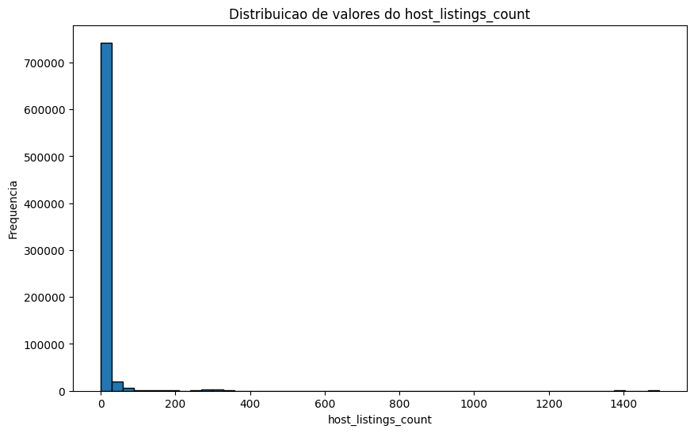
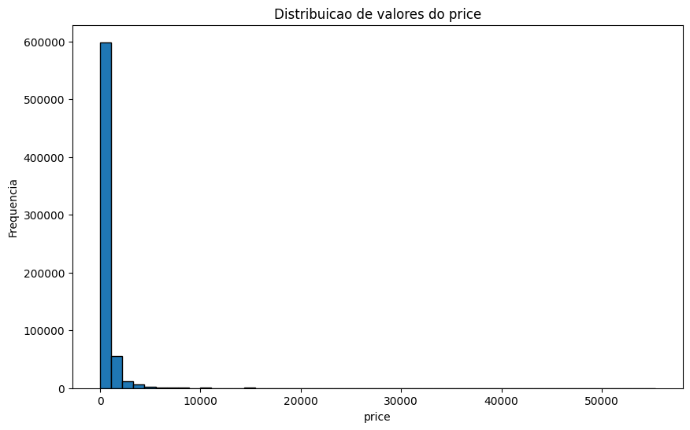
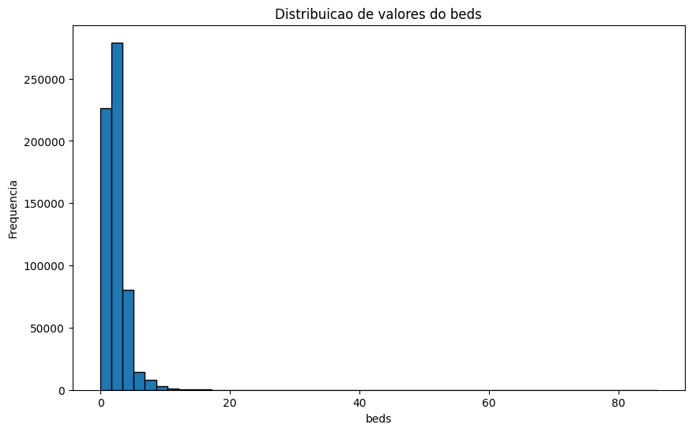
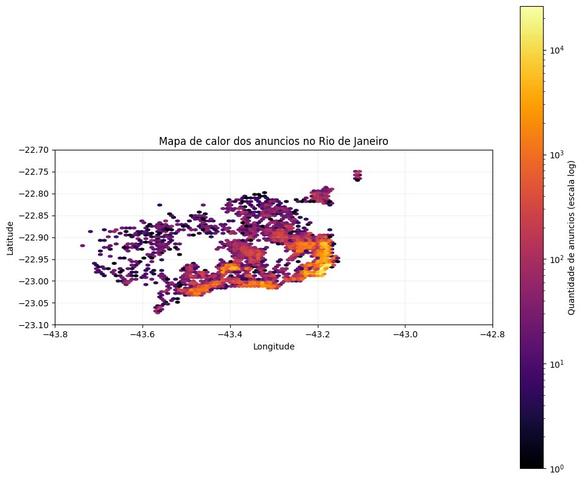
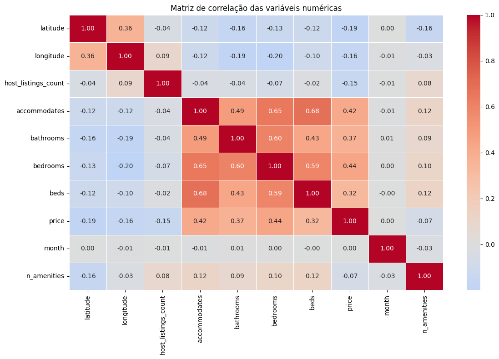
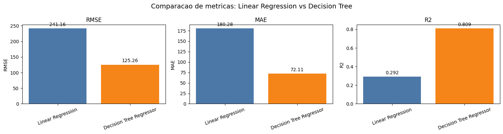
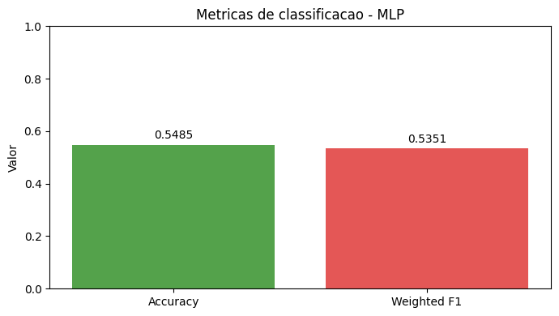
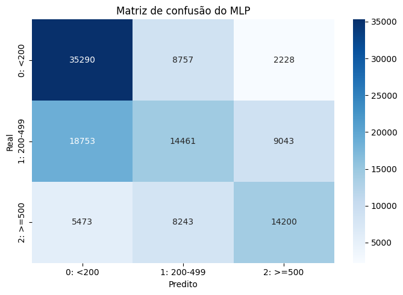

<!-- _class: lead title-slide -->

# Análise de preços de imóveis no Airbnb
## Rio de Janeiro — Regressão e Classificação com Apache Spark

**Dataset**: Airbnb Rio de Janeiro
**Modelos**: Regressão Linear, Decision Tree, MLP

---

<!-- _class: lead title-slide -->

# Agenda

### Parte 1: Dados
Coleta, limpeza e análise exploratória

### Parte 2: Modelos
Configuração dos modelos de regressão e classificação

### Parte 3: Resultados
Métricas, comparações e conclusões

---

<!-- _header: "" -->
<!-- _class: lead part-dados -->

# Parte 1: Dados

**Coleta, limpeza e análise exploratória**

---

<!-- header: "**Dados** > Modelos > Resultados" -->

# Visão geral do dataset

- **Fonte**: Airbnb — listagens do Rio de Janeiro
- **Volume inicial**: 784.122 registros, 16 colunas
- Carregado via Spark com leitura em `.parquet`
- Coluna alvo: `price` (valor numérico, extraído de string `$X,XXX.XX`)

| Coluna | Descrição |
|--------|-----------|
| `latitude`, `longitude` | Localização geográfica do imóvel |
| `host_is_superhost` | Se o anfitrião possui status superhost |
| `host_listings_count` | Quantidade de listagens do anfitrião |
| `property_type` | Tipo do imóvel (Apartment, House…) |
| `accommodates` | Capacidade máxima de hóspedes |
| `bathrooms`, `bedrooms`, `beds` | Estrutura física do imóvel |
| `amenities` | Lista de comodidades disponíveis |
| `price` | Preço por noite — **coluna alvo** |
| `require_guest_profile_picture` | Exige foto de perfil do hóspede |
| `require_guest_phone_verification` | Exige verificação de telefone |
| `month` | Mês da listagem |

---

# Limpeza de nulos

| Coluna | Nulos antes |
|--------|-------------|
| `bathrooms` | 1.494 |
| `beds` | 2.335 |
| `security_deposit` | 361.064 |
| `cleaning_fee` | 269.336 |

- `security_deposit` e `cleaning_fee` removidos do escopo
- Demais linhas com nulos dropadas: **4.087 removidas**
- Dataset após limpeza: **780.035 registros**

---

# Remoção de outliers — `host_listings_count`

> Fence IQR: **6 listagens** — limite superior calculado pelo método IQR (Q3 + 1,5×IQR); registros acima considerados outliers. 99.528 removidos.

---

# Remoção de outliers — `price`

> Fence IQR: **R$ 1.276** — limite superior pelo método IQR; listagens com preço acima deste valor consideradas outliers. 66.365 removidos.

---

# Remoção de outliers — `beds`

> Fence IQR: **6 camas** — limite superior pelo método IQR; imóveis com mais camas considerados outliers. 13.846 removidos.

---

# Consolidação de `property_type`

Tipos raros (34 categorias) agrupados em `Other`:
`Aparthotel`, `Cabin`, `Hotel`, `Boat`, `Tent`, `Yurt`, e outros

**Tipos mantidos individualmente:**
`Apartment`, `House`, `Condominium`, `Loft`, `Serviced apartment`, `Other`

---

# `amenities` — conversão para contagem

- Campo original: string `{TV, "Cable TV", Wifi, ...}`
- Convertido para `n_amenities` = contagem de itens
- Registros com `{}` recebem o valor da moda
- Fence IQR: **42 amenidades** — 17.635 removidos

**Dataset final: ~582.581 registros, 13 features**

---

# Mapa de calor — listagens no Rio de Janeiro

---

# Matriz de correlação

---

<!-- _header: "" -->
<!-- _class: lead part-modelos -->

# Parte 2: Modelos

**Configuração dos algoritmos de regressão e classificação**

---

<!-- header: "Dados > **Modelos** > Resultados" -->

# Features utilizadas (13)

| Feature | Tipo |
|---------|------|
| `latitude`, `longitude` | Numérico |
| `host_is_superhost` | Booleano → int |
| `host_listings_count` | Inteiro |
| `accommodates`, `bathrooms`, `bedrooms`, `beds` | Inteiro |
| `month` | Inteiro |
| `property_type` | Label encoded |
| `require_guest_profile_picture`, `require_guest_phone_verification` | Booleano → int |
| `n_amenities` | Inteiro |

Split: **80% treino / 20% teste** (seed=42)

---

# Regressão Linear

- **Alvo**: `price` (valor contínuo)
- `maxIter=200` — número máximo de iterações do otimizador de gradiente
- `regParam=0.01` — intensidade da regularização para penalizar coeficientes altos
- `elasticNetParam=0.0` — regularização L2 pura (Ridge), sem componente L1
- Serve como baseline — assume relação linear entre features e preço

---

# Decision Tree Regressor

- **Alvo**: `price` (valor contínuo)
- `maxDepth=30` — profundidade máxima da árvore; controla complexidade do modelo
- `minInstancesPerNode=15` — mínimo de amostras por nó folha; reduz overfitting
- `maxBins=32` — número de bins para discretizar features contínuas no split

---

# MLP Classifier — faixas de preço

Classificação em 3 faixas:

| Classe | Faixa | Registros | % |
|--------|-------|-----------|---|
| 0 — econômico | `price < 200` | 232.001 | 39,8% |
| 1 — intermediário | `200 ≤ price < 500` | 211.311 | 36,3% |
| 2 — premium | `price ≥ 500` | 139.349 | 23,9% |

- `layers=[13, 16, 3]` — 13 entradas, 1 camada oculta com 16 neurônios, 3 saídas
- `maxIter=50`, `blockSize=512` — iterações e tamanho do mini-batch
- solver `l-bfgs` — otimizador quasi-Newton, eficiente para datasets médios

---

<!-- _header: "" -->
<!-- _class: lead part-resultados -->

# Parte 3: Resultados

**Métricas, comparações e conclusões**

---

<!-- header: "Dados > Modelos > **Resultados**" -->

# Regressão — comparação de métricas

- **RMSE**: Decision Tree reduz o erro em ~48% — predições mais próximas do valor real
- **MAE**: erro médio cai de R$ 180 para R$ 72 — diferença prática significativa
- **R²**: sobe de 0,29 para 0,81 — a árvore explica quase 3× mais variância do preço

---

# Regressão — resumo numérico

| Modelo | RMSE | MAE | R² |
|--------|------|-----|----|
| Regressão Linear | 241,16 | 180,28 | 0,292 |
| **Decision Tree** | **125,26** | **72,11** | **0,809** |

- Decision Tree supera a regressão linear em todas as métricas
- R² de 0,809 indica boa capacidade explicativa do modelo
- MAE de 72 indica erro médio de ~R$ 72 na estimativa de preço

---

# MLP — métricas de classificação

**Acurácia geral: 54,85% — F1 ponderado: 53,51%**

---

# MLP — matriz de confusão

---

# MLP — desempenho por classe

| Classe | Corretos | Total | Acurácia |
|--------|----------|-------|----------|
| 0 — econômico (`<200`) | 35.205 | 46.441 | **75,8%** |
| 1 — intermediário (`200-499`) | 14.601 | 42.180 | 34,6% |
| 2 — premium (`≥500`) | 14.155 | 27.984 | 50,6% |

- Classe econômica melhor classificada (separação mais nítida)
- Classe intermediária com maior confusão — fronteiras de preço são difusas
- Arquitetura leve (`[13,16,3]`) limitou capacidade do modelo

---

# Conclusões

- **Decision Tree** obteve melhor desempenho na regressão (R²=0,81, MAE=72)
- **Regressão Linear** serve como baseline fraco — features têm relações não-lineares com preço
- **MLP** com arquitetura leve atingiu 54,85% de acurácia — margem relevante sobre aleatório (33%)
- Faixa intermediária é a mais difícil de classificar para todos os modelos
- Próximos passos: tuning de profundidade do DT e aumento de capacidade do MLP

---

<!-- _class: lead title-slide -->

# Obrigado

Dataset: Airbnb Rio de Janeiro · Spark MLlib · Maio 2026
